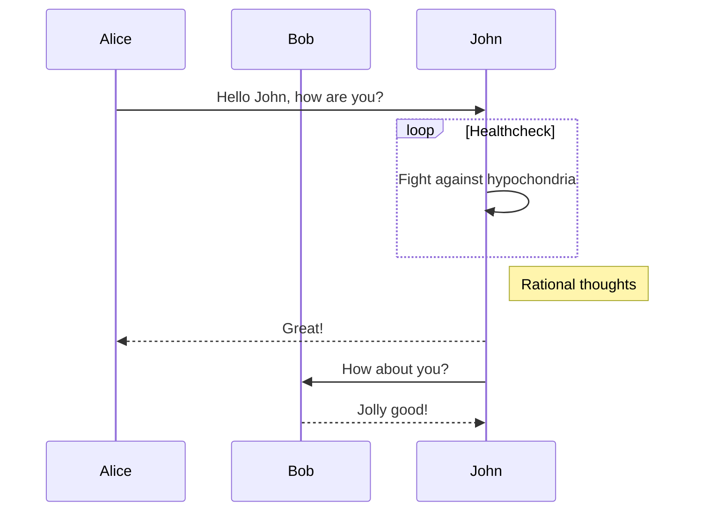

# graph（流程图）

## 图方向

* TB，从上到下
* TD，从上到下
* BT，从下到上
* RL，从右到左
* LR，从左到右
> T = TOP，B = BOTTOM，L = LEFT，R = RIGHT，D = DOWN


## 节点形状

* 默认节点 A
* 文本节点 B[bname]
* 圆角节点 C(cname)
* 圆形节点 D((dname))
* 非对称节点 E>ename]
* 菱形节点 F{fname}

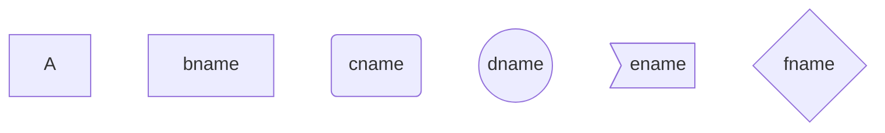

## 连线

节点间的连接线有多种形状，可以在连接线中加入标签：
  * 箭头连接 A1–->B1
  * 开放连接 A2—B2
  * 标签连接 A3–text—B3
  * 箭头标签连接 A4–text–>B4
  * 虚线开放连接 A5.-B5
  * 虚线箭头连接 A6-.->B6
  * 标签虚线连接 A7-.text.-B7
  * 标签虚线箭头连接 A8-.text.->B8
  * 粗线开放连接 A9===B9
  * 粗线箭头连接 A10==>B10
  * 标签粗线开放连接 A11==text===B11
  * 标签粗线箭头连接 A12==text==>B12


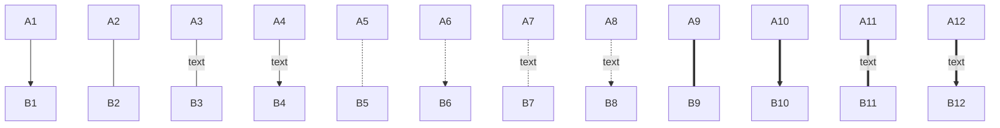
### example

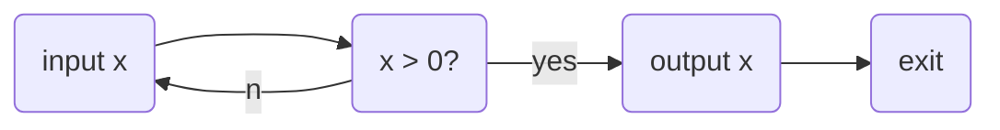

# subgraph（子图）
> 外面的那层, 可以使用子图中的节点，子图中的节点名不是隔离的，可以认为是全局变量-.-
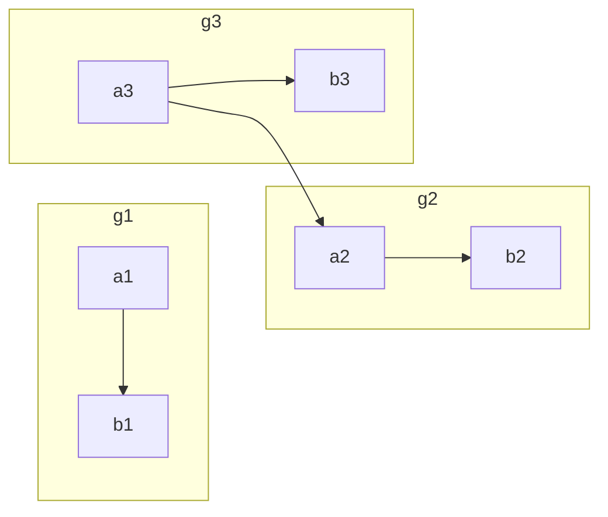

# sequence diagram （序列图）

## 关键字

* participant，参与者，相当先定义模块，可通过设定参与者(participant)的顺序控制展示顺序
* note， 便签，格式如下
```
  note [right of | left of][Actor]:Text
  # 给多个模块做标签, 通过逗号分割
  note over [Actor1, Actor2...]:Text
```
* 循环
```
  loop Loop_text
  ... statements...
  end
```
* 选择
```
  alt Describing_text
  ...statements...
  else
  ...statements...
  end

  # 推荐在没有else的情况下使用 opt(option,选择)

  opt Describing_text
  ...statements...
  end
```

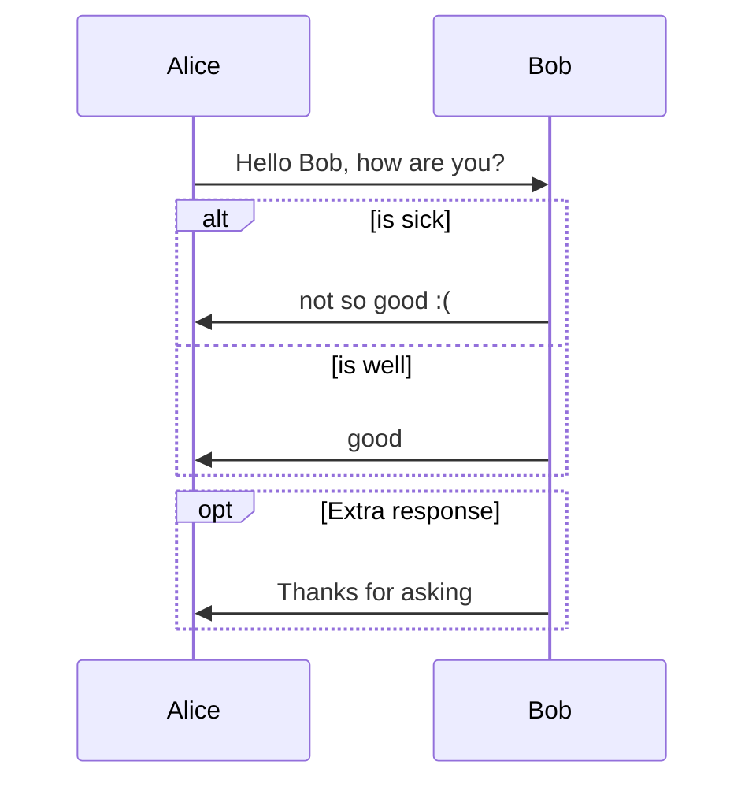

## 连线
* 无箭头实线 ->
* 有箭头实线 ->>
* 无箭头虚线 –>
* 有箭头虚线 –>>
* 带x实线 -x
* 带x虚线 –x

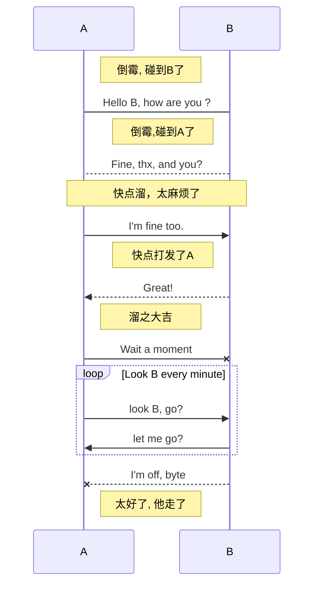

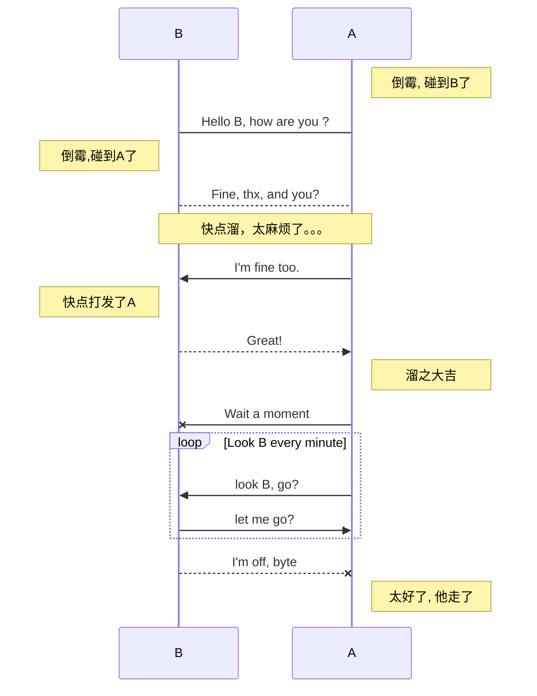


# gantt diagram(甘特图)

甘特图是一类条形图，由Karol Adamiechi在1896年提出, 而在1910年Henry Gantt也独立的提出了此种图形表示。通常用在对项目终端元素和总结元素的开始及完成时间进行的描述

## 关键字如下    
title|标题
--|--
dateFormat	|  日期格式
section	    |  模块
Completed	  |  已经完成
Active	    |  当前正在进行
Future	    |  后续待处理
crit	      |  关键阶段
日期缺失     |	默认从上一项完成后

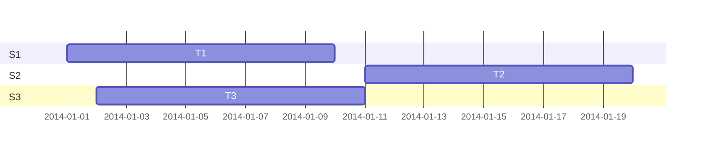

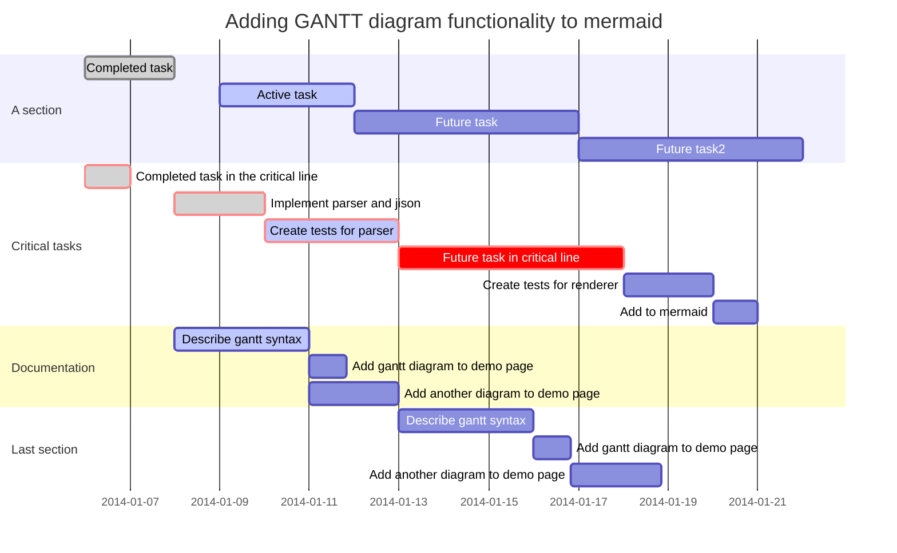

# sequence（序列图）

## 关键字

  * title，定义序列图的标题

  * participant，定义时序图中的对象

  * note，定义对时序图中的部分说明

  * 方位控制    
    left of，表示当前对象的左侧   
    right of，表示当前对象的右侧    
    over，表示覆盖在当前对象（们）的上面
  * {actor}，表示时序图中的具体对象（名称自定义）

  * 箭头分为以下几种：
    1. -> 表示实线实箭头
    1. –> 表示虚线实箭头
    1. ->> 表示实线虚箭头
    1. –>> 表示虚线虚箭头

### example

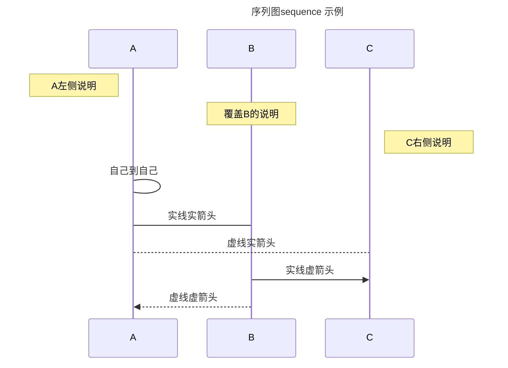

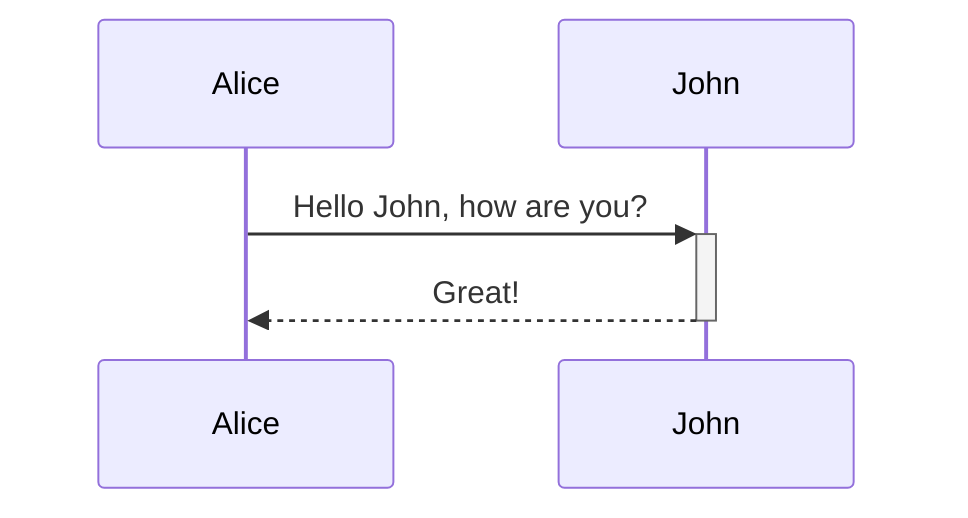

# flow（流程图）
## 关键字
  * start/end，表示程序的开始与结束
  * operation，表示程序的处理块
  * subroutine，表示子程序块
  * condition，表示程序的条件判断
  * inputoutput，表示程序的出入输出
  * right/left，表示当前连线在当前模块上的起点(默认从下端开始)
  * yes/no， 表示condition判断的分支(可以和right，left同时使用)

通过定义模块与连接，再结合以上关键词即可定义简单流程图的各个模块。

### 模块定义(模块标识与模块名称可以任意定义名称，但是不能为关键词)：
```
  模块标识(相当于变量名)=>模块关键词: 模块名称(模块中显示的文字)
```
### 连接定义如下:
```
  模块标识1->模块标识2
  模块标识1->模块标识2->模块标识3
  ...
```

### 进行连接的时候，可以通过right，left确定箭头的起点。
### 使用condition关键词定义的判断框的连接需要结合yes或者no使用，如

```mermaid
flowDiagram
  st=>start: 开始
  e=>end: 结束
  op=>operation: 输入x
  sub=>subroutine: 是否重新输入
  cond1=>condition: x>0?
  cond2=>condition: yes/no 
  io=>inputoutput: 输出x  

  st(right)->op->cond1
  cond1(yes)->io(right)->e
  cond1(no)->sub(right)->cond2()
  cond2(yes, right)->op
  cond2(no)->e
```